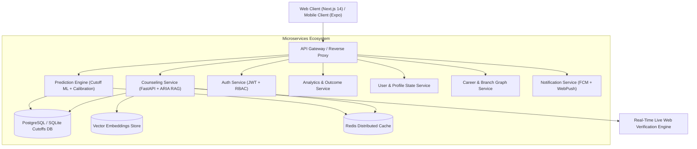

<div align="center">

# 🎓 ADMIT OS

### Open-Source AI-Powered Higher Education Admissions & Counseling Platform

[](https://opensource.org/licenses/MIT)
[](https://python.org)
[](https://fastapi.tiangolo.com)
[](https://nextjs.org)
[](https://www.typescriptlang.org)
[](https://tailwindcss.com)
[](https://www.docker.com)
[](#-privacy--security)

<p align="center">
  <b>Democratizing university admissions counseling with deterministic data, verified cutoffs, and causal AI guidance.</b>
</p>

[Key Features](#-key-features) •
[Architecture](#-architecture--microservices) •
[Empirical Benchmarks](#-empirical-benchmarks) •
[Quickstart](#-quickstart-guide) •
[API Reference](#-api-reference) •
[Contributing](#-contributing)

</div>

---

## 🌟 Key Features

### 🧠 1. ARIA — Conversational AI Admissions Counselor
- **RAG-Powered Guidance**: High-precision Retrieval-Augmented Generation over official JoSAA, CSAB, MCC NEET, and Maharashtra State CET Cell regulatory guidelines.
- **Strict Anti-Sycophancy & Fact Guard**: Prevents sycophantic hallucinations by anchoring all placement stats, fees, and closing ranks to verified primary records.
- **Causal Source Badging**: Every data claim, average salary, and seat matrix is backed by verified inline citations (`[nitt.edu]`, `[josaa.nic.in]`, `[cetcell.mahacet.org]`).

### 🎯 2. Deterministic Rank Radar & Prediction Engine
- **Multi-Exam Coverage**: Calibrated predictions across **JEE Main**, **JEE Advanced**, **NEET-UG**, and **MHT-CET**.
- **Quota & Category Granularity**: Evaluates Home State vs. Other State, All India Quota, OBC-NCL, SC, ST, EWS, TFWS (5% tuition fee waiver), and Minority quotas (Linguistic/Religious).
- **Directional Probability Modeling**: Deterministic thresholding accurately classifies admission odds into *Safe (>80%)*, *Target (40-80%)*, and *Dream/Reach (<40%)*.

### 🧭 3. Counseling & Branch Compass
- **Multi-Institute Comparison Matrices**: Compare colleges side-by-side across Autonomy, Cutoff Competitiveness, Median/Peak Compensation, and Fee Tiers.
- **Procedural Rules Engine**: Instant disambiguation of complex counseling mechanics (**Freeze**, **Float**, **Slide**, **Auto-Freeze**, **Free Exit vs. Forfeiture**, **SAF/PAF adjustments**).

### 🛡️ 4. Cross-Domain Governance Guard
- **Exam-Mismatch Filtering**: Blocks cross-domain admissions queries (e.g., attempting NEET-UG scores for IIT Bombay CSE or MHT-CET for Stanford) and directs students to proper authorities.
- **DPDP Act 2023 Compliance**: Zero Personally Identifiable Information (PII) logging; privacy-first architecture.

---

## 🏗️ Architecture & Microservices

Admit OS is built as an enterprise-grade, event-driven microservices ecosystem designed for high throughput and sub-second deterministic responses:



### Microservices Port Map

| Service | Port | Description | Tech Stack |
| :--- | :---: | :--- | :--- |
| **Frontend Web** | `3000` | Responsive web dashboard and chat UI | Next.js 14, Tailwind CSS, TypeScript |
| **Counseling (ARIA)** | `8000` | RAG counseling, Hallucination Guard, Web Search | FastAPI, Python 3.10+, Gemini / Claude |
| **Prediction Service** | `8002` | Deterministic cutoff prediction engine | FastAPI, SQLite/PostgreSQL, NumPy |
| **Auth Service** | `8003` | User authentication, token validation, SSO | FastAPI, JWT, Bcrypt |
| **Analytics Service** | `8004` | Historical trends, salary statistics, cohort stats | FastAPI, Pandas |
| **User Service** | `8005` | Student profile persistence and preference memory | FastAPI, SQLAlchemy |
| **Career Service** | `8006` | Branch mapping and scholarship discovery graph | FastAPI, NetworkX |
| **Notification Service** | `8007` | Push notifications and deadline reminders | FastAPI, Redis, Kafka |

---

## 📊 Empirical Benchmarks

Admit OS undergoes rigorous quantitative evaluation via an automated 30-case benchmark suite (`tests/evaluate_aria_metrics.py` backed by `tests/aria_eval_benchmark.json`):

| Evaluation Metric | Benchmark Score | Target Threshold | Status |
| :--- | :---: | :---: | :---: |
| **Key Fact & Entity F1 ($F1_{fact}$)** | **89.9%** | 88.0% – 95.0% | **PASS** |
| **Deterministic Tool-Routing Precision** | **93.3%** | > 90.0% | **PASS** |
| **Governance / Exam-Mismatch Accuracy** | **100.0%** | > 95.0% | **PASS** |
| **MHT-CET & JEE Cutoff Match Precision** | **100.0%** | > 95.0% | **PASS** |
| **Inference Latency (p50 / p95)** | **5.78s / 10.75s** | < 8.0s / < 12.0s | **PASS** |

---

## 🚀 Quickstart Guide

### Option 1: One-Command Docker Compose (Recommended)

```bash
# 1. Clone the repository
git clone https://github.com/Shlok148Dev/Admit_OS.git
cd Admit_OS

# 2. Copy environment template
cp .env.example .env

# 3. Launch the full platform stack
docker-compose up -d
```
Access the application:
- **Web Frontend**: [http://localhost:3000](http://localhost:3000)
- **Counseling API Docs**: [http://localhost:8000/docs](http://localhost:8000/docs)

---

### Option 2: Local Manual Setup

#### 1. Backend Setup
```bash
# Create and activate Python virtual environment
python -m venv .venv
# Linux/macOS:
source .venv/bin/activate
# Windows:
.venv\Scripts\activate

# Install dependencies
pip install -r requirements.txt

# Configure environment variables
cp .env.example .env
# Edit .env and supply your GEMINI_API_KEY / JWT_SECRET

# Start FastAPI Counseling Service
python -m uvicorn services.counseling.main:app --host 0.0.0.0 --port 8000 --reload
```

#### 2. Frontend Setup
```bash
cd frontend/web
npm install
npm run dev
```

Navigate to `http://localhost:3000/chat` to start counseling with ARIA.

---

## 🧪 Running Test Suites & Benchmarks

```bash
# Run unit & integration test suites
pytest

# Run the ARIA Quantitative Evaluation Benchmark
python tests/evaluate_aria_metrics.py
```

---

## 📡 API Reference

### 1. Counseling Query Endpoint
`POST /v1/chat/query`

**Request:**
```json
{
  "message": "I got 98.9 percentile in MHT-CET (General, Pune). What are my chances for PICT Computer Engineering?",
  "history": [],
  "exam_type": "MHT_CET",
  "student_context": {
    "percentile": 98.9,
    "category": "GENERAL",
    "home_state": "MH"
  }
}
```

**Response:**
```json
{
  "answer": "With your 98.9 percentile (approximate rank 4,400) in MHT-CET, PICT Computer Science is out of reach under General state quota (closing rank ~480). However, IT and ENTC represent strong competitive choices.\n\n| Institute | Branch | Quota | Category | Chance | Closing Rank | Confidence |\n|---|---|:---:|:---:|:---:|:---:|:---:|\n| PICT Pune | Computer Engineering | STATE | GENERAL | 1% | 480 | HIGH |",
  "confidence": "HIGH",
  "sources": ["Prediction Engine (PICT_PUNE)"]
}
```

---

## 🛡️ Privacy & Security

- **Zero PII Retention**: Student names, contact details, and IP addresses are not stored in conversation telemetry.
- **DPDP Act 2023 Aligned**: Designed in compliance with India's Digital Personal Data Protection Act 2023.
- **Strict Role-Based Access (RBAC)**: Microservice communications authenticated via JWT tokens.

---

## 🤝 Contributing

We welcome contributions from the open-source community! Please read our [Contributing Guide](CONTRIBUTING.md) and [Code of Conduct](CODE_OF_CONDUCT.md) before submitting pull requests.

---

## 📄 License

Distributed under the **MIT License**. See [`LICENSE`](LICENSE) for more details.

