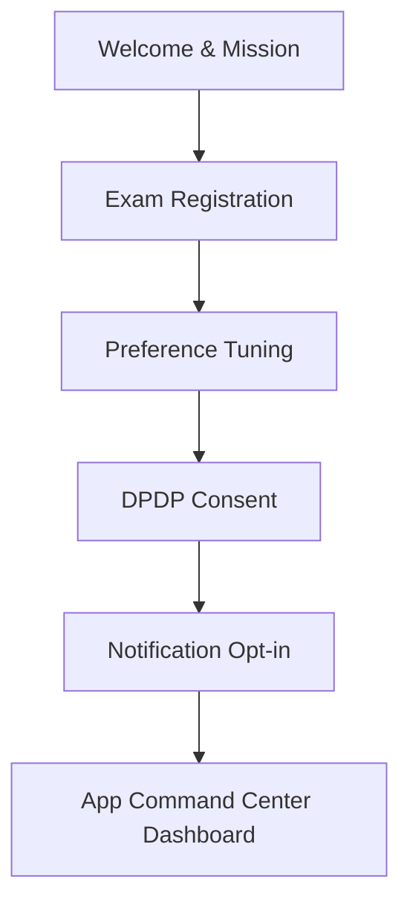

# ADMIT OS — Onboarding Screens Specification

## Visual Design & Aesthetics
- **Theme**: Dark-mode primary (Sleek Obsidian & Midnight Blue), with glassmorphism panels.
- **Accents**: Emerald Green for safety/confirmation, Amber for caution/important alerts, and Electric Purple for premium AI features.
- **Typography**: Inter (UI elements) and Outfit (headings/titles).
- **Animations**: Soft fade-in on transition, slide-up for forms, micro-bounce for select states.

---

## Onboarding Flow Overview

---

## Screen-by-Screen Copy & UX

### Screen 1: Welcome & Mission
- **Heading**: The Post-Exam Command Center.
- **Body**: Welcome to ADMIT OS. From result day to college admission, we help you make your rank count with hyper-accurate predictions, choice list builders, and real-time alerts.
- **CTA Button**: Get Started
- **UX Element**: A smooth micro-animation of a radar scanning or a compass needle settling.

### Screen 2: Exam & Profile Registration
- **Heading**: Tell us about your exams
- **Fields**:
  - **Primary Exam Selection**: Dropdown/Selector (JEE Main, JEE Advanced, NEET-UG, MHT-CET, KCET, COMEDK)
  - **Year**: default 2026
  - **Rank/Score Input**: 
    - All India Rank (CRL)
    - Category Rank (if applicable)
    - Percentile (optional)
  - **Category**: GENERAL, OBC-NCL, SC, ST, EWS, PwD
  - **Home State**: State Selector dropdown
  - **Gender**: Male, Female, Other
- **Helper Text**: *Privacy Guard: Your exam data is stored securely. We do not ask for your official roll number or credentials.*
- **CTA Button**: Next: Preferences

### Screen 3: Preference Tuning (The Compass)
- **Heading**: What matters most to you?
- **Subheading**: Adjust the sliders. The AI Counseling Compass will use this to optimize your choices.
- **Sliders (0-100%)**:
    1. **College Brand**: e.g., Tier-1 IITs/NITs vs. others (Weight: 40%)
    2. **Branch Interest**: e.g., CS/IT vs. Mechanical/Chemical/Civil (Weight: 30%)
    3. **Location/City**: e.g., Proximity to metro hubs, home state (Weight: 20%)
    4. **Fee Budget**: e.g., ROI, scholarships, low semester fees (Weight: 10%)
- **CTA Button**: Next: Privacy Setup

### Screen 4: Privacy & DPDP Compliance Consent
- **Heading**: Your Data, Your Control.
- **Body**: In compliance with the Indian **DPDP Act 2023**, we ensure:
  - **Data Minimization**: We only collect what's necessary to predict your college options.
  - **No PII Sharing**: Your email and phone are kept in a separate, secure auth DB. No personal identifiers are logged.
  - **No Sponsored Bias**: We never sell your data to colleges or show sponsored rankings.
  - **Right to Erasure**: Delete your profile and all predictions instantly with a single tap in settings.
- **Checkbox Label**: [ ] I consent to ADMIT OS processing my exam details for college predictions and choice list optimization.
- **CTA Button**: Agree & Continue (Disabled until checkbox is ticked)

### Screen 5: Notification Nerve Center Setup
- **Heading**: Stay Updated Instantly
- **Subheading**: Counseling dates and allotments are fast-paced. Choose how you want to be notified.
- **Toggle Switches**:
  - [x] **Push Notifications** (Critical deadlines, Round allotments)
  - [x] **WhatsApp Alerts** (One-tap choice lists, priority cutoff changes)
  - [x] **Email Updates** (Weekly counseling newsletters, deep-dive guides)
- **CTA Button**: Enter ADMIT OS
